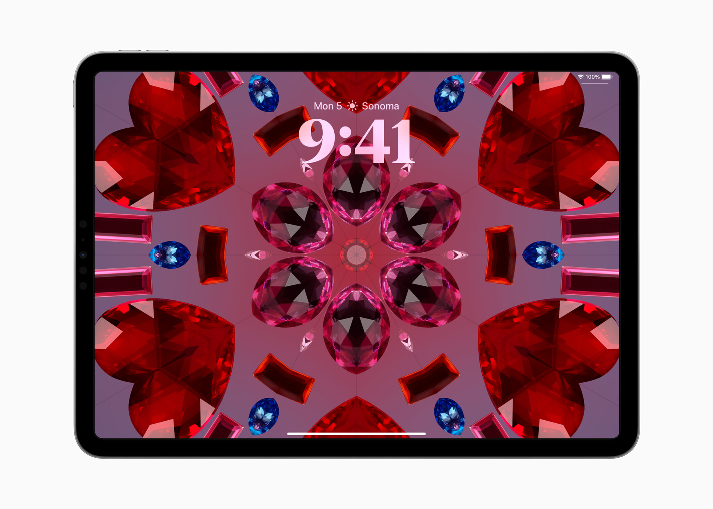

# lche0503_9103_tut01

## Part 1: Imaging Technique Inspiration

I am inspired by the kaleidoscope-style motion in Apple’s Lock Screen and the layered textures of Pacita Abad’s *Wheels of Fortune*. Both use symmetry, color, and repetition to create dynamic energy. I want to combine the animated kaleidoscope effect with the handcrafted feel of Abad’s work. The movement and symmetry in Apple’s design feels hypnotic, while Abad’s textures add emotional richness. Together, they create something playful and personal. This approach not only catches the eye — it also helps express layered emotions and shifting moods, which aligns perfectly with the goals of this project.

### Image References

## Part 2: Coding Technique Exploration

The coding technique I found is from the [websarasa.js](https://taisukef.github.io/websarasa/) library, which allows simple but dynamic shape rendering in JavaScript. This technique makes it easier to generate repetitive, symmetrical patterns like those in Apple’s kaleidoscope lock screen. Its loop-based drawing and color manipulation features support layering and motion — essential for achieving hypnotic, shifting visuals. This method helps simulate the rhythmic, handcrafted energy of Pacita Abad’s work through code.

### Example Code

- [GitHub: websarasa.js Repository](https://github.com/taisukef/websarasa)
- [Live Demo](https://taisukef.github.io/websarasa/simple.html)
